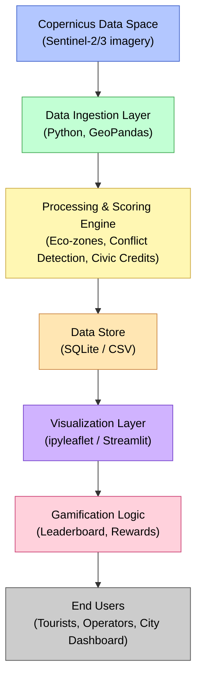

# Race_Publica — Software Architecture & Data Flow

## Mission
Create a gamified navigation layer for Berlin’s waterways using Copernicus and Galileo data.  
Participants (vessels, tourists, operators) earn Civic Credits for eco-friendly routes that reduce congestion and environmental stress.

---

## System Overview
```text
┌──────────────────────┐
│ Copernicus Data Space│  ← Satellite imagery (Sentinel-2/3)
└──────────┬───────────┘
           ↓
┌───────────────────────────────┐
│ Data Ingestion Layer (Python) │
│ - Download/parse GeoTIFFs     │
│ - Import OSM/GeoJSON waterways│
│ - Simulate vessel tracks      │
└──────────┬────────────────────┘
           ↓
┌───────────────────────────────┐
│ Processing & Scoring Engine   │
│ - Zone sensitivity analysis   │
│ - Conflict detection          │
│ - Civic Credit rules          │
│ (GeoPandas, Pandas, Shapely)  │
└──────────┬────────────────────┘
           ↓
┌───────────────────────────────┐
│ Data Store                    │
│ - SQLite / CSV / JSON         │
│ - Stores vessel tracks, scores│
└──────────┬────────────────────┘
           ↓
┌───────────────────────────────┐
│ Visualization Layer           │
│ - Jupyter + ipyleaflet maps   │
│ - Streamlit / Plotly dashboard│
│ - Leaderboard & Eco Index     │
└──────────┬────────────────────┘
           ↓
┌───────────────────────────────┐
│ Gamification & Rewards Logic  │
│ - Civic Credit engine (Python)│
│ - Mock tokenization module    │
└───────────────────────────────┘
```

## Key Components & Libraries


| Layer | Tools | Purpose |
|-------|--------|----------|
| **Data Access** | `sentinelsat`, Copernicus Data Space API | Download Sentinel-2 imagery for water analysis |
| **Geospatial Analysis** | `GeoPandas`, `Shapely`, `rasterio` | Process waterways, zones, and vessel tracks |
| **Visualization (Prototype)** | `ipyleaflet`, `folium`, `plotly`, `matplotlib` | Interactive maps & analytics inside Jupyter |
| **Visualization (MVP Web)** | `Streamlit`, `leafmap` | Public-facing demo with scoring and leaderboard |
| **Data Storage** | `SQLite`, `CSV`, `JSON` | Lightweight persistence |
| **Gamification Logic** | Python functions | Civic Credit calculations, eco-score updates |
| **Version Control** | GitHub | Collaboration and reproducibility |
| **Deployment (optional)** | Streamlit Cloud | Free online hosting for demo app |

## Data Flow Description

1. Ingest Copernicus Sentinel-2 imagery via API and clip to Berlin’s waterways.

2. Import OpenStreetMap/GeoJSON shapefile for river geometry.

3. Process raster and vector data to assign sensitivity scores to segments.

4. Simulate Galileo-like vessel positions (synthetic data).

5. Score routes based on overlap with sensitive areas and timing (off-peak earns more).

6. Store results in SQLite/CSV.

7. Visualise dynamic map with ipyleaflet (dev) and Streamlit (demo).

8. Display leaderboard, total eco-credits and district eco-index.

9. (Optional) Tokenise credits for interoperability with city systems.

## Development Roles

## 🚀 Development Roles

| Role | Member | Focus |
|------|---------|--------|
| **Data Engineering & Ingestion** | Pavlo | Copernicus data access, file structure |
| **Data Science / Scoring** | Sahand | Rule logic, analytics, KPIs |
| **Technical Lead / PM** | Jeremy | Architecture, founder, visualisation, gamification |
| **Frontend / UX ** | Ivan | Streamlit/React UI, leaderboard polish |


---

## 🧭 System Architecture (Mermaid Diagram)




## Output of Hackathon MVP

Streamlit web app hosted online.

Interactive map (ipyleaflet → Streamlit).

Three sample vessels with live score updates.

Leaderboard & eco-score dashboard.

Pitch deck + architecture diagram (this doc).

## Future Integration

Replace simulated tracks with Galileo GNSS data from real vessels.

Live telemetry via Kineis Satellite IoT network.

Expand Civic Credits to blockchain-based eco-tokens.

Integration with VisitBerlin for reward redemption.

## Quick Summary

Stack: Python, GeoPandas, ipyleaflet, Streamlit, SQLite

Data sources: Copernicus Sentinel-2/3, OSM waterways

Output: gamified sustainability dashboard

Value: transforms satellite data into a civic incentive engine


### 🧩 Simulation Engine (Pavlo Sviatushenko)
- Graph-based model of Berlin waterways (~75k nodes, 979k edges)
- Simulates 3 navigation strategies:
  - 🟢 *Greenest route* (max NDWI)
  - 🔵 *Shortest route*
  - 🔴 *Chaotic route*
- Calculates scores, NDWI averages, and route rankings.
- Notebook: [`notebooks/simulation_engine.ipynb`](notebooks/simulation_engine.ipynb)
- Output visuals stored in [`screenshots/`](screenshots/)


📄 **Full Simulation Notebook (with all outputs)**
For reproducibility, the complete 135 MB notebook is archived here:
https://drive.google.com/file/d/1t2Xd-vSUdSxlESOuQXcfBq7w6_mN4b6j/view?usp=sharing

